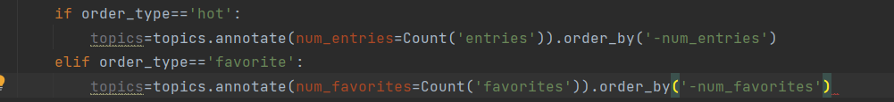
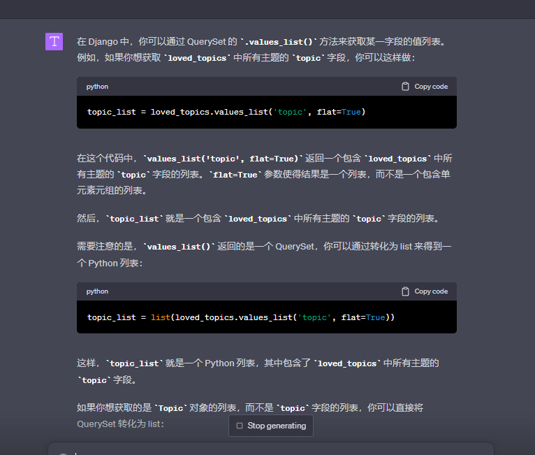
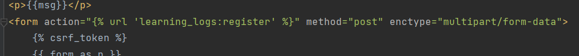
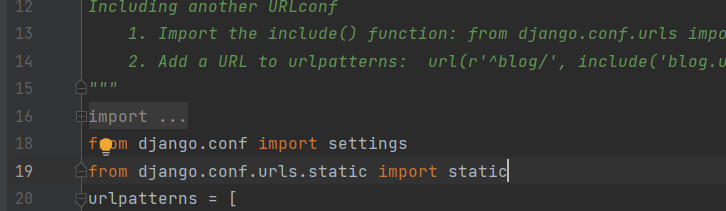
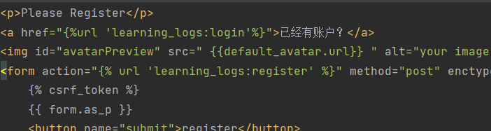
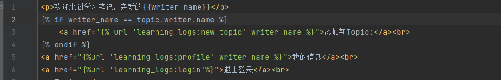
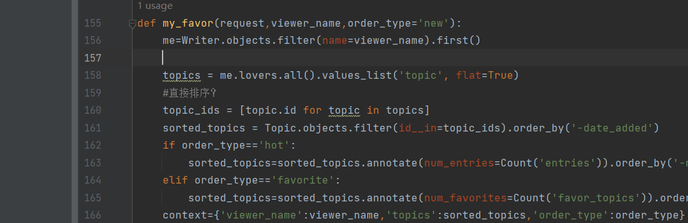

# django-18学习

>下面记录的是已经实现的功能或者步骤，顺序也是实现的顺序

## super用户
1. 注册超级用户，登录超级用户
2. model录入超级用户
3. 使用超级用户来管理模型,在admin中

## 定义model
1. 在写一个model class
2. 模型迁移
    + 模型会自带ID，也可以自己定义，默认从1开始自增

## 配置url文件
1.一级文件urls.py中的配置，跳到二级urls中
2.二级文件中url.py中配置，在一级中用include转到二级文件中，指定对应的views中的函数
3.views中的写函数，拿数据库中数据，写入content——一个dir格式的内容，传到html文件中
4.html文件直接用content中内容

# django-19x学习

>下面记录的是已经实现的功能或者步骤，顺序也是实现的顺序

## 用户输入数据

+ meta的含义的-定义模型的元数据
  
1. 定义一个用于接受数据的class
2. import写一个用于接受post的函数
3. import写一个对应的html文件，接受表单数据，传输给一给函数new_topic
?没有写入数据库
4. widgets？没有太理解
5. 一定要注意传参url！！！多处url格式正确，并且使用时候正确传参，，"(,)"之类的代表缺失

# 自己写

1.ID的问题怎么解决？
2.url传参数
3.定义模型
    + 问题在于不可空但是没默认值
4.图片的后端往前传输，url的参数的自动传输，注意本地开发时media_root和media_url的配置和使用，案例见下，来自gpt
```commandline
在 Django 中，如果你在模型中定义了 ImageField 或 FileField，当用户通过表单上传文件时，Django 会自动把文件保存在 MEDIA_ROOT 指定的目录下，并在数据库中保存文件的相对路径。

例如，你有如下的模型：

python
Copy code
class Register_Writer(models.Model):
    # 其他字段...
    avatar = models.ImageField(upload_to='user_images')
当用户上传头像时，Django 会把头像文件保存在 MEDIA_ROOT/user_images 目录下，然后在 avatar 字段中保存文件的相对路径，例如 'user_images/avatar.jpg'。

你可以在视图函数中这样处理用户上传的头像：

python
Copy code
def register(request):
    if request.method == 'POST':
        form = RegisterForm(request.POST, request.FILES)
        if form.is_valid():
            new_writer = form.save()
            # 重定向到新用户的个人信息页面
            return HttpResponseRedirect(reverse('profile', args=[new_writer.id]))
    else:
        form = RegisterForm()

    return render(request, 'register.html', {'form': form})
在这个视图函数中，当收到 POST 请求时，你创建一个绑定了数据和文件的 RegisterForm 实例。如果表单数据是有效的，你保存表单数据，创建一个新的 Register_Writer 实例。Django 会自动把用户上传的头像保存在 MEDIA_ROOT/user_images 目录下，然后在 avatar 字段中保存文件的相对路径。

你可以在模板中这样显示用户的头像：

html
Copy code

当你访问 writer.avatar.url 时，Django 会把 MEDIA_URL 和 avatar 字段的值结合起来，生成一个完整的 URL。这个 URL 指向用户上传的头像文件。当浏览器加载这个 URL 时，Django 会返回 MEDIA_ROOT/user_images/avatar.jpg 这个文件的内容。

```

5.如何去count一个model的被关联数量

如果是自身参数直接order_by('-id')就可以了，如果是外键，需要用到annotate

6.正反约束的引用，怎么拿值




# 写的时候遇到的bug
bug1: 传输图片的时候需要在form中加入enctype="multipart/form-data"

bug2:没有在url中配置 media的使用包含 media的url和root,需要配置 media_url media_root 以及在url文件中掉包配置static
root的使用是规定默认存放地点，url是规定访问的url

src 是怎么显示的，是因为在html中使用了{{}}，这个是django的模板语言，可以直接使用python的变量，这里的变量是一个对象，所以可以直接使用对象的属性

bug3: django中的if == 两边必须有空格

bug4.抄错函数

